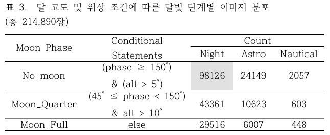
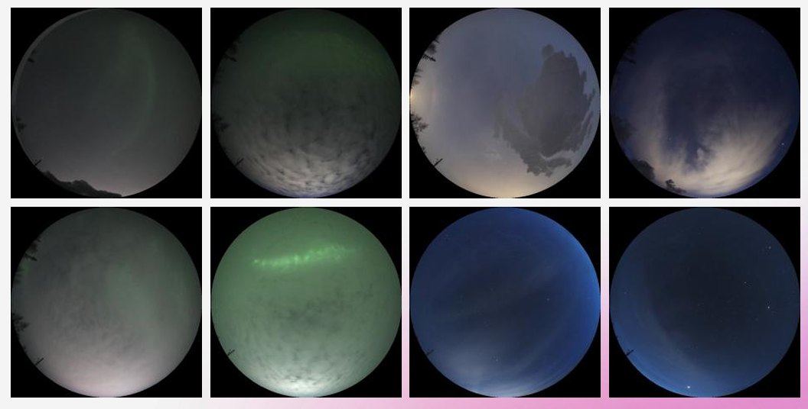

# aurora-gradcam
Aurora image classification with EfficientNet and Grad-CAM

# Aurora Classification with EfficientNet-B1 and Grad-CAM 
A physically informed deep-learning pipeline for automatic aurora detection in all-sky images, with interpretable explanations and condition-wise analysis. 

## Abstract 
We present an end-to-end pipeline for binary aurora detection in all-sky imagery. Timelapse videos from the AuroraMAX site in Yellowknife (Canada) were sampled at one-minute intervals, circularly masked to remove horizon clutter, and cropped to 720×720 images, yielding 214,890 frames from 331 nights across 2022–2025. Time stamps were OCR-extracted, corrected, and standardized to UTC to ensure reliable temporal ordering. 
To control illumination, frames were categorized by solar altitude (Night ≤ −18°, Astronomical, Nautical, Civil/Day) and lunar phase/altitude (No_Moon, Moon_Quarter, Moon_Full). Training/validation used Night & No_Moon only. 
An EfficientNet-B1 classifier (ImageNet initialization) was trained for 12 epochs in two stages—classifier-only then full fine-tuning—achieving a peak validation accuracy of 95.59% with loss < 0.10 and no overfitting signs. We used Grad-CAM to visualize decision evidence. Applying the trained model to all frames produced an overall aurora ratio of 39.3%; condition-wise analysis indicated more FPs in Moon_Quarter × Nautical and more FNs in No_Moon × Nautical. 

 
*Figure 1. End-to-end workflow for aurora detection, from frame extraction and physical filtering (solar altitude, lunar phase) to dataset labeling, EfficientNet-B1 fine-tuning, and Grad-CAM interpretability.* 

## Data 
- Source: AuroraMAX all-sky camera (CSA & University of Calgary), Yellowknife, NWT, Canada; public outreach observatory providing fisheye all-sky videos. 
- Acquisition windows: three multi-month periods from 2022-12-01 → 2025-02-28. 
- Frame extraction & cleaning: 1-minute sampling; circular mask (center (640, 360), radius 360 px); 720×720 JPG export; OCR of on-frame timestamps; MST/MDT → UTC normalization via time-zone conversion; filenames encoded with UTC. 
- Scale: 214,890 images from 331 nights. 

 *Figure 2. Distribution of images across moon phases and illumination conditions (Night, Astronomical twilight, Nautical twilight). Only Night & No_Moon images were used for training/validation.* 

## Physical Filtering 
- Solar altitude bins (Skyfield): Night ≤ −18°, Astronomical (−18°…−12°), Nautical (−12°…−6°). 
    - Counts among all frames: Night 171,003 (79.6%), Astronomical 40,779, Nautical 3,108. 
    - Only Night images entered training. 
- Lunar condition bins (altitude + phase): No_Moon, Moon_Quarter, Moon_Full. 
    - No_Moon totals 124,332 (57.9%); moonlit classes were excluded from training. 

## Labeled Subset & Split 
From Night & No_Moon frames (98,126 candidates), 4,563 images were manually labeled (yes aurora / no none) using a date-aware sampling strategy. 

Splits were balanced by design: 
- Train: 1,024 (yes) / 1,024 (no)  
- Validation: 329 (yes) / 329 (no) 

## Model & Training 
- Backbone: EfficientNet-B1 (ImageNet pretrained), 2-class head. 
- Schedule: 12 epochs—6 with frozen backbone (classifier only), then 6 with full fine-tuning. 
- Selection: best epoch chosen by lowest validation loss / highest accuracy (Epoch 10). 

## Results 
- Validation: accuracy improved from 86.47% initially to a maximum of 95.59% after fine-tuning, with stable loss (< 0.10) and no overfitting observed. 

 
*Figure 3. Example Grad-CAM overlays (top: original images, bottom: heatmaps) showing that the model attends to auroral arcs and bright structures. Right: validation accuracy and loss curves over 12 epochs, reaching 95.6% accuracy with stable convergence.* 

 
*Figure 4. Training loss (blue) and validation accuracy (purple) across 12 epochs. Fine-tuning after epoch 6 improved generalization without overfitting.* 

- Full-set inference (all 214,890 images): average aurora ratio = 39.3%; class ratios by illumination condition are tabulated in the thesis. Moon_Quarter × Nautical shows elevated FPs, while No_Moon × Nautical shows elevated FNs. 

### Interpretability 
We used Grad-CAM on the final EfficientNet-B1 block to inspect model evidence for yes/no decisions, and combined heatmaps with condition-wise counts and softmax outputs to diagnose error patterns across observing regimes. 

### Key Contributions 
- A physically informed pipeline that integrates solar/lunar filtering with deep learning on a large all-sky dataset. 
- A balanced, date-aware labeling and split strategy for Night & No_Moon images. 
- High validation accuracy (95.59%) with interpretable decision evidence and condition-wise diagnostics on the full corpus. 

## Limitations & Outlook 
This work addresses binary detection only. Future directions include multi-class auroral morphology/intensity labels, richer per-condition metrics, quantitative use of Grad-CAM maps, and coupling with solar-wind/geomagnetic indices for forecasting applications. (See Discussion in thesis.) 

 
*Figure 5. Representative error cases: false positives (clouds or bright horizon mistaken for aurora) and false negatives (faint or diffuse aurora). Errors were most frequent under Astronomical/Nautical twilight, reflecting sensitivity to rapid brightness changes.* 

## Repository Guide preprocessing/ 
– solar/lunar filtering & dataset construction training/ 
– EfficientNet-B1 fine-tuning (12-epoch schedule) inference/ 
– batch prediction on held-out or full datasets gradcam/ 
– Grad-CAM export scripts (overlay and raw maps) 

## How to Cite 
If you use this code or analysis, please cite the thesis (see thesis/) and this repository.